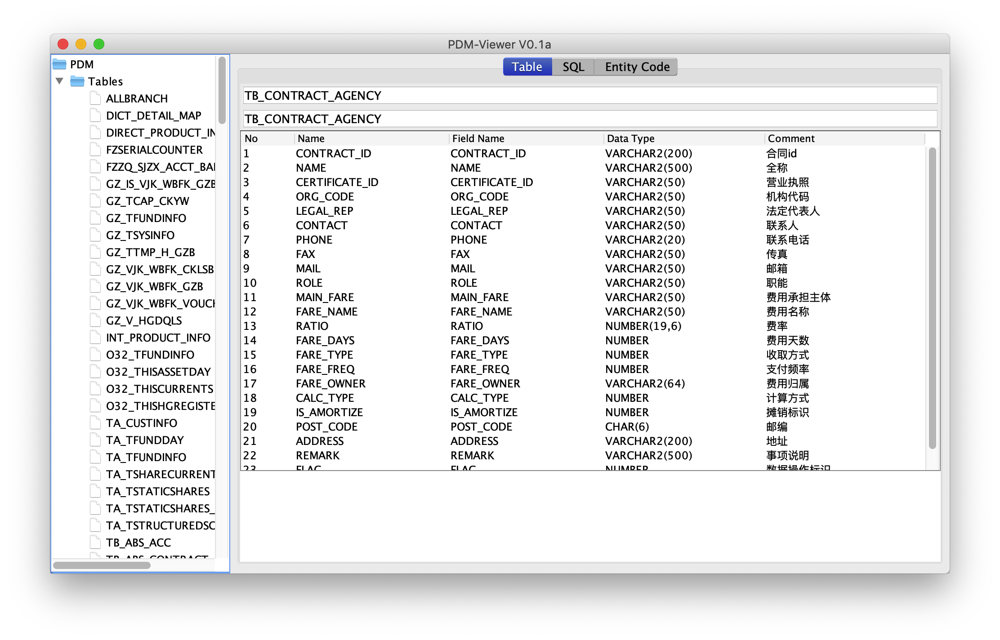

## pdm-viewer




该项目源代码来源于 [pdm-viewer](https://github.com/yjgoo/pdm-viewer)   
这里主要是通过增加支持maven编译的 `pom.xml` 文件来简化编译。

## 编译

下载源代码，并使用 `maven` 进行编译

```
git clone https://github.com/wgzhao/pdmviewer
cd pdmviewer
mvn clean package
```

## 运行

成功编译后，可通过下面的方式运行 
`java -jar target/pdmviewer-1.0-jar-with-dependencies.jar`

